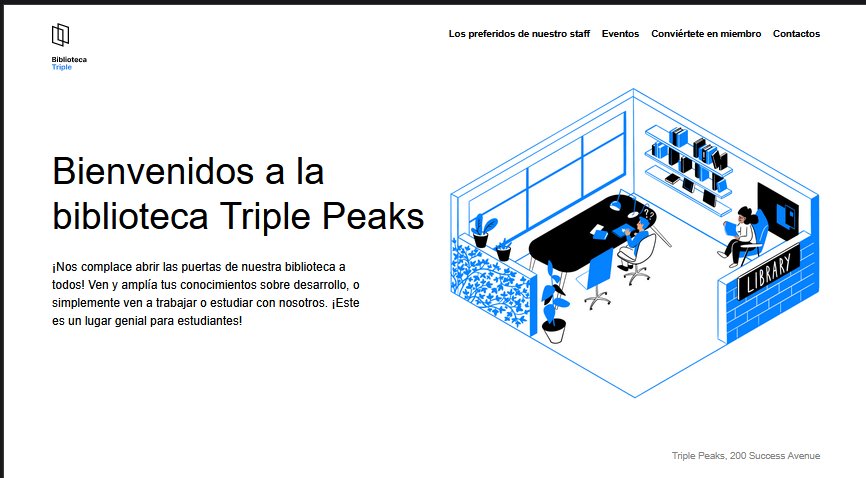
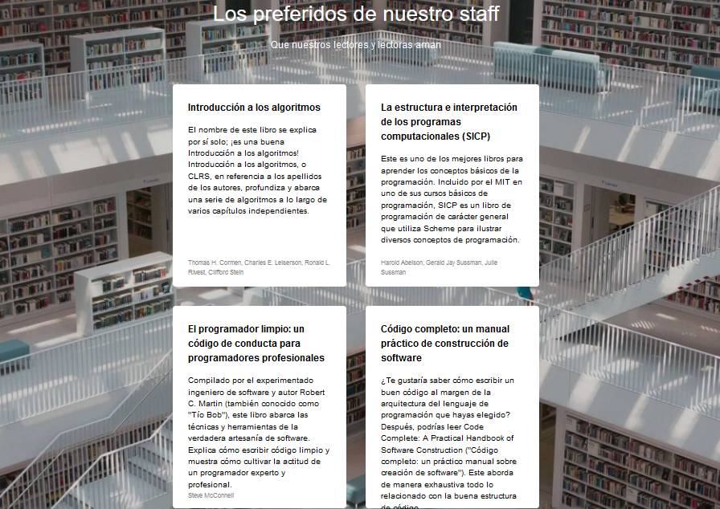
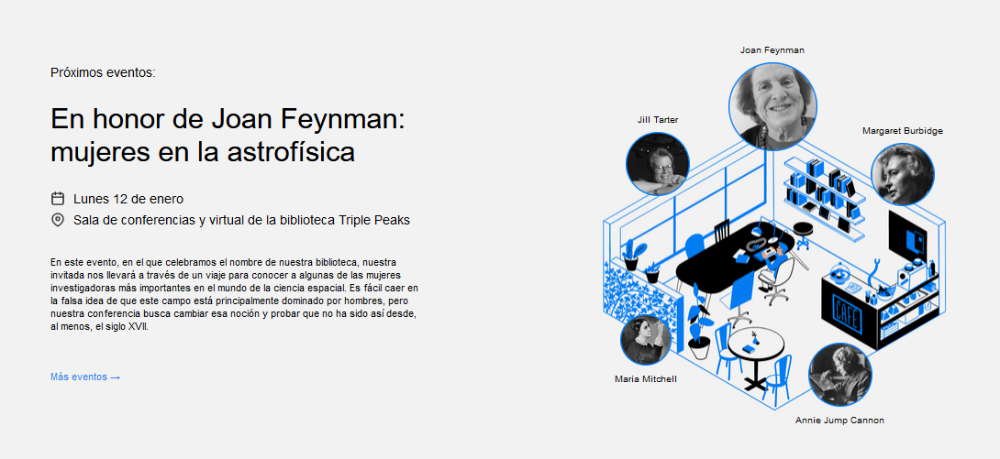
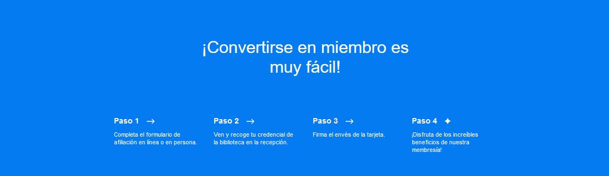
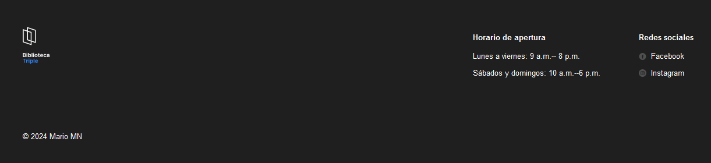

# Web Project Library

## De que trata este proyecto?

### Una página web orientada a una biblioteca virtual, la cuál esta compuesta por las siguentes secciones:

1. El Encabezado

Se utilizó flexbox para elaborar la barra de navegación, se comprendio mejor el uso de padding, margin y column-gap para ordenar los elementos, como se muestra en la imágen.

2. Sección Staff

Se elaborarón una targetas que contienen una breve descripción de títulos recomendados, para organizar las cartas se utilizo flex conjuntamente con la propiedad flex-wrap, además propiedades como text-align, margin 0 auto, sirvierón mucho para centrar los elementos y el texto que contienen.

La propiedades background-image, background-size, background-repeat y background-position se emplearón para ajustar la imagén de fondo con el fin de ajustarse esteticamente a la sección correspondiente.

3.  Sección Events

Este apartado contiene información de eventos como conferencias a honor de Feynman, en este caso la conferencia trata de las mujeres investigadoras más importantes de la astrofísica.

Se utilizó mucho el posicionamiento absoluto para acomodar las imágenes de las mujeres como aparecen en la imágen, además se practico mucho con la metodología BEM para separar las imagénes pequeñas de las grandes y para el contenedor principal de todas las imágenes se empleo flex-basis, flex-shrink y flex grow.

4. Sección Membership:

Esta sección contiene información breve para convertirse en miembro de la biblioteca virtual, para su elaboración se siguio prácticando con flex, para acomodar la información de manera horizontal, en dondé dicha información fue colocada como una lista desordenada y al texto se le aplico también flex para alinearlos al centro.

5. Sección footer:

Ese es el último apartado, para terminarlo se utilizó flex de una manera más avanazada ya que la propiedad flex direction se uso conjuntamente, es decir los elementos están acomodados de manera vertical al mismo tiempo horizontalmente, también la metodología BEM ayudo mucho para distinguir mejor el posicionamiento de cada columna.

Algo muy importante que se aprendío fue en como colocarle hipervínculos a los iconos de las redes sociales, y en como centralos con su texto correpsonidente con flex, align-items y gap.

Github pages:

https://melomario57.github.io/web_project_library/
